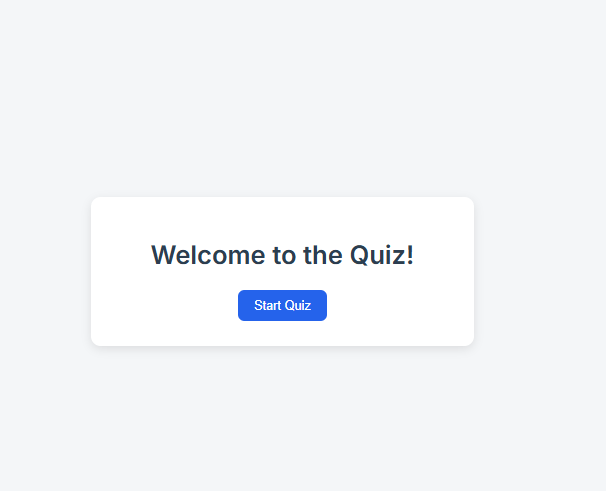
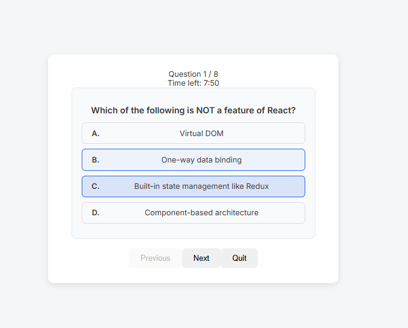
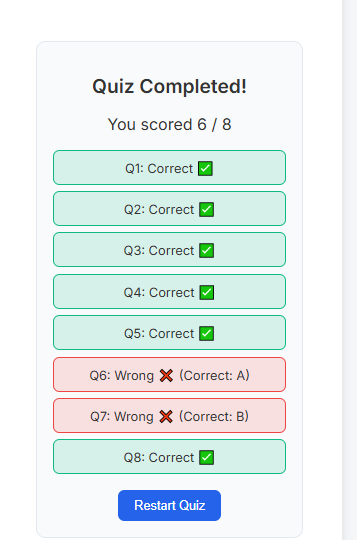

## Quiz App V1 — Full‑Stack (React + Node/Express + MongoDB)


### Project Overview
This is a simple quiz application with a timer, scoring, and a results screen. The project is split into a Frontend (React + Vite) and a Backend (Node.js/Express with MongoDB). The backend seeds a few sample questions on first run and exposes APIs to fetch questions and submit answers.

### Table of Contents
- [Project Overview](#project-overview)
- [Features](#features)
- [Tech Stack](#tech-stack)
- [Setup Instructions (Local)](#setup-instructions-local)
- [Backend API](#backend-api)
- [Design Choices & Assumptions](#design-choices--assumptions)
- [Folder Structure](#folder-structure)
- [Screenshots](#screenshots)
- [Development Tips](#development-tips)
- [Scripts Quick Reference](#scripts-quick-reference)

### Features
- **Start quiz**: Begin a quiz session and fetch questions from the backend.
- **Timer**: Global countdown based on number of questions (60s per question).
- **Multiple‑choice questions**: Select one option per question.
- **Submit & results**: Server calculates score and returns detailed correctness per question.
- **Restart/quit**: Return to start screen at any time and try again.
- **Backend API**: Fetch questions and submit answers for scoring.

### Tech Stack
- **Frontend**: React, Context API, CSS, Vite
- **Backend**: Node.js, Express, MongoDB (Mongoose)

---

## Setup Instructions (Local)

### 1) Clone the repository
```bash
git clone https://github.com/AsjadJDawre/QuizzApp.git
cd QuizzApp
```

### 2) Install dependencies
Install both backend and frontend packages:
```bash
cd Backend-QuizzApp && npm install
cd ../Frontend-quizApp && npm install
```

### 3) Configure environment variables

Create a `.env` file in `Backend-QuizzApp/`:
```env
# Backend-QuizzApp/.env
PORT=3000
DB_URL=mongodb://127.0.0.1:27017/quizapp # Your Mongodb Atlas URL
```

Optionally, create a `.env` file in `Frontend-quizApp/` if your backend runs on a different URL/port:
```env
# Frontend-quizApp/.env
VITE_Backend_url=http://localhost:3000
```

Notes:
- The frontend defaults to `http://localhost:3000` for the backend if `VITE_Backend_url` is not set.
- Vite dev server typically runs on `http://localhost:5173`.

### 4) Run the backend
From the backend folder:
```bash
cd Backend-QuizzApp
# If you have nodemon installed globally, you can use it; otherwise run node directly
node index.js
# or
nodemon index.js
```

On first run, the backend seeds a set of example questions when the database is empty. Ensure MongoDB is running and reachable via `DB_URL`.

### 5) Run the frontend
From the frontend folder:
```bash
cd Frontend-quizApp
npm run dev
```

Open the app in the browser at:
```text
http://localhost:5173
```

---

## Backend API

Base URL (local): `http://localhost:3000/api`

| Method | Endpoint        | Description                 | Request Body                          | Response (200)                        |
|--------|------------------|-----------------------------|----------------------------------------|---------------------------------------|
| GET    | `/questions`     | Get all quiz questions      | —                                      | `{ questions: [{ _id, text, options }] }` |
| POST   | `/quiz/submit`   | Submit answers for grading  | `{ answers: [{ id, selectedIndex }] }` | `{ score, total, result: [{ isCorrect, correctIndex }] }` |

Example request for submit:
```json
{
  "answers": [
    { "id": "66f...abc", "selectedIndex": 2 },
    { "id": "66f...def", "selectedIndex": 0 }
  ]
}
```

Notes:
- Each answer is `{ id, selectedIndex }`. The backend compares `selectedIndex` with the stored `correctIndex` for each question.
- Questions returned by the backend include `_id`, `text`, and `options`.

---

## Design Choices & Assumptions
- **Timer policy**: 60 seconds per question (global countdown across the quiz).
- **Answer shape**: `{ id, selectedIndex }` sent to the backend.
- **Minimal UI**: Simple, responsive layout focused on clarity and speed.
- **State management**: React Context API instead of Redux for a lightweight global state.
- **Backend data**: Assumes the backend returns questions with `_id`, `text`, and `options` fields.
- **Seeding**: Backend seeds example questions on first run when the collection is empty.

---

## Folder Structure

```text
QuizAppV1/
  Backend-QuizzApp/
    config/
      config.js             # Mongo connection using DB_URL
    controller.js/
      questions.js          # getQuestions, checkResult controllers
    models/
      questions.js          # Mongoose schema and model
    routes/
      quiz.js               # /api/questions, /api/quiz/submit
    index.js                # Express app entry (uses PORT)
    seed.js                 # Seeds initial questions if empty
    package.json

  Frontend-quizApp/
    src/
      context/QuizContext.jsx  # App state, API calls, submit logic
      components/
        Start.jsx
        Quiz.jsx
        Question.jsx
        Results.jsx
      App.jsx
      styles/
        Quizz.css, Results.css, Start.css
    index.html
    package.json
```

---

## Screenshots

| Screen | Image |
|---|---|
| Start |  |
| Quiz |  |
| Results |  |

---

## Development Tips
- If you change the backend port, update `VITE_Backend_url` in `Frontend-quizApp/.env` accordingly.
- Ensure CORS is allowed for the frontend origin (default dev origin is `http://localhost:5173`).
- If you add more questions or fields, keep the response shapes consistent with what the frontend expects.

---

## Scripts Quick Reference

Frontend (`Frontend-quizApp/`):
```bash
npm run dev       # Start Vite dev server
npm run build     # Production build
npm run preview   # Preview production build
```

Backend (`Backend-QuizzApp/`):
```bash
node index.js     # Start server
# nodemon index.js # Optional: auto-restart on changes
```

---

Happy quizzing! ✨


